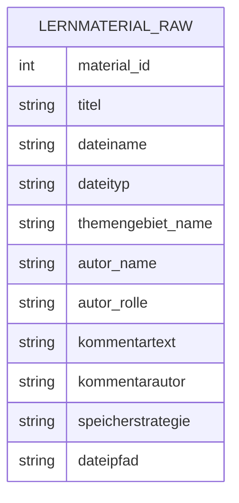
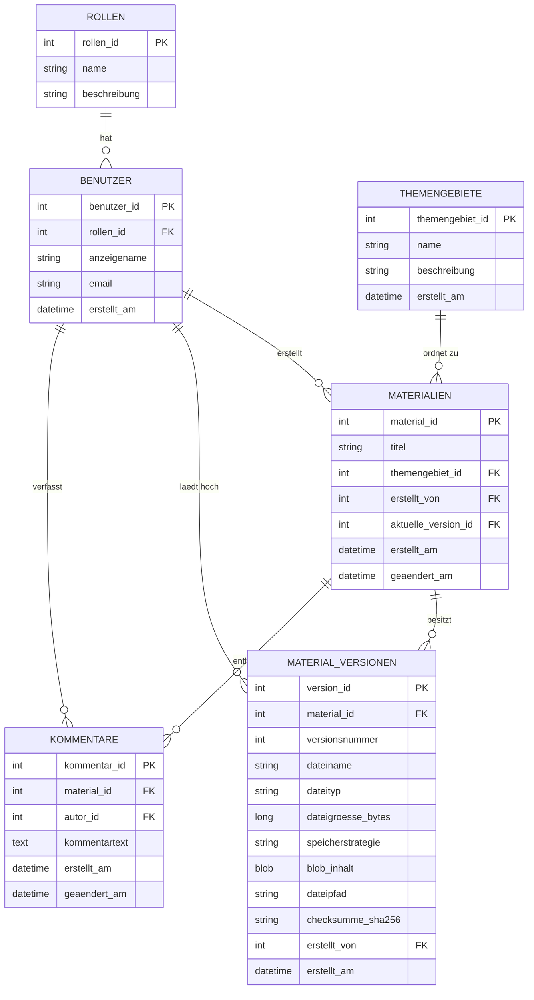

# Technische Dokumentation

## 1. Projektkontext

Im Ausgangsszenario wurden Lernmaterialien unstrukturiert in Ordnern verteilt oder manuell weitergegeben. Daraus ergaben sich Probleme bei Suche, Versionierung, Aktualisierung und Nachvollziehbarkeit. Das Ziel der Anwendung ist deshalb eine datenbankgestuetzte Verwaltung, die Materialien revisionsfaehig speichert, gezielt durchsucht und mit Kommentaren ergaenzt.

## 2. Anforderungsanalyse

Pflichtanforderungen aus dem Arbeitsauftrag:

- MySQL als Datenbank
- Python-Anwendung mit textbasierter Eingabemaske
- Upload, Suche und Download von Lernmaterialien
- Kommentare zu Materialien
- Genau ein Themengebiet pro Material
- Metadaten zu Material und Kommentar
- Versionierung der Materialien
- Mindestens sieben Standardabfragen
- Mindestens drei zusaetzliche sinnvolle Entitaeten

Fachliche Entscheidungen in dieser Umsetzung:

- `rollen` trennt Lehrkraefte und Auszubildende
- `benutzer` verwaltet Autoren und Kommentarautoren
- `material_versionen` bildet die revisionssichere Ablage ab
- `materialien` referenziert immer die aktuelle Version
- Dateien unter `1_000_000` Byte werden als BLOB gespeichert
- groessere Dateien werden im Dateisystem abgelegt und in MySQL per Pfad referenziert

## 3. ERM vor der Normalisierung

Ein ungeeignetes Ausgangsmodell waere eine einzige Sammelstruktur, in der Material, Themengebiet, Autor, Kommentar und Speicherort gemeinsam abgelegt werden. Das fuehrt zu Redundanzen und Aenderungsanomalien.

Probleme dieses Modells:

- Themengebiete und Rollen werden mehrfach wiederholt
- mehrere Kommentare pro Material fuehren zu Duplikaten in Materialdaten
- Versionen eines Materials koennen nicht sauber abgebildet werden
- Autoren- und Benutzerinformationen sind nicht sauber getrennt

## 4. Normalisierung

### 4.1 Erste Normalform

Alle Felder werden atomar gehalten. Wiederholungsgruppen wie mehrere Kommentare oder mehrere Versionen werden aus der Rohstruktur entfernt und in eigene Tabellen ausgelagert.

### 4.2 Zweite Normalform

Nicht schluesselabhaengige Attribute werden an die fachlich passende Entitaet verschoben:

- Rollenbeschreibungen nach `rollen`
- Themengebietsinformationen nach `themengebiete`
- Kommentare nach `kommentare`
- Dateispezifische Angaben nach `material_versionen`

### 4.3 Dritte Normalform

Transitive Abhaengigkeiten werden aufgeloest:

- Benutzerrolle wird nicht im Benutzertext wiederholt, sondern ueber `rollen_id` referenziert
- Themengebietsname wird nicht im Material gespeichert, sondern ueber `themengebiet_id`
- aktueller Dateiname und Dateityp werden nicht redundant in `materialien`, sondern in der jeweils aktuellen Version gehalten

## 5. Finales ERD / ERM

## 6. Tabellen und Schluessel

### rollen

- Stammdaten fuer Lehrkraft und Auszubildende
- `rollen_id` als Primaerschluessel
- `name` eindeutig

### benutzer

- verwaltet Autoren von Materialien und Kommentaren
- Fremdschluessel auf `rollen`
- `email` eindeutig

### themengebiete

- ordnet Materialien fachlich zu
- ein Material gehoert genau einem Themengebiet

### materialien

- fachlicher Stamm eines Lernmaterials
- haelt Titel, Themengebiet, Ersteller und Verweis auf die aktuelle Version

### material_versionen

- revisionssichere Historie der Materialdateien
- jede neue Fassung erzeugt einen neuen Versionsdatensatz
- enthaelt Dateiname, Dateityp, Dateigroesse, Speicherstrategie, Pfad oder BLOB und Checksumme

### kommentare

- mehrere Kommentare pro Material moeglich
- Kommentar besitzt Autor, Erstelldatum und Aenderungsdatum

## 7. Speicherstrategie

Die Speicherstrategie wird automatisiert im Python-Service entschieden:

- Wenn `dateigroesse_bytes < 1_000_000`, dann Speicherung als `DB_BLOB`
- sonst Speicherung als `DATEISYSTEM`

Damit werden kleine Dateien direkt in MySQL vorgehalten und groessere Dateien performanter im Dateisystem verwaltet.

## 8. Standardabfragen

Die Anwendung implementiert exakt sieben feste Abfragen:

1. Aggregation: Anzahl der Materialien pro Themengebiet
2. Aggregation: Anzahl der Kommentare pro Material
3. Inner Join: Materialien mit Themengebiet
4. Inner Join: Materialien mit Autor
5. Join plus Aggregation: Anzahl Materialien pro Autor
6. Mehrtabellen-Join: Material plus Themengebiet plus Autor
7. Mehrtabellen-Join: Material plus Kommentare plus Kommentarautor

Die SQL-Statements liegen zusaetzlich gesammelt in [sql/03_standardabfragen.sql](/Users/bogdanszovga/PycharmProjects/bbsliothek/sql/03_standardabfragen.sql).

## 9. Integritaet und Validierung

Technische Integritaet:

- Primaer- und Fremdschluessel
- `UNIQUE` auf Rollenname, Benutzer-E-Mail und Themengebiet
- Indizes auf Suchfelder wie Dateiname, Dateityp, Themengebiet und Autor

Fachliche Validierung in Python:

- Datei muss existieren
- Kommentar darf nicht leer sein
- Benutzer und Themengebiet muessen vorhanden sein
- neue Materialien benoetigen Titel und Themengebiet
- beim Download wird ein fehlender Dateipfad sauber abgefangen
